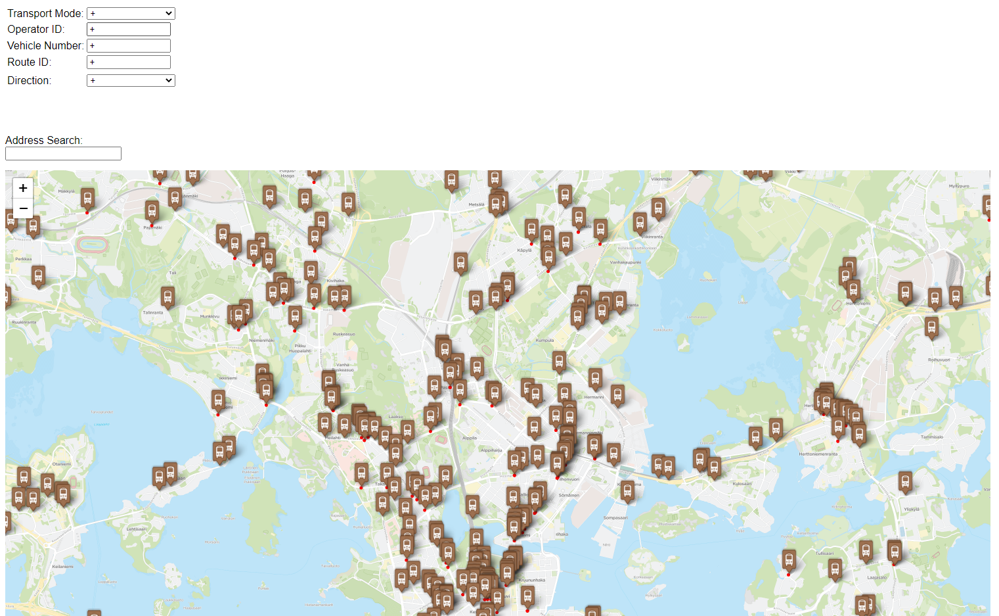
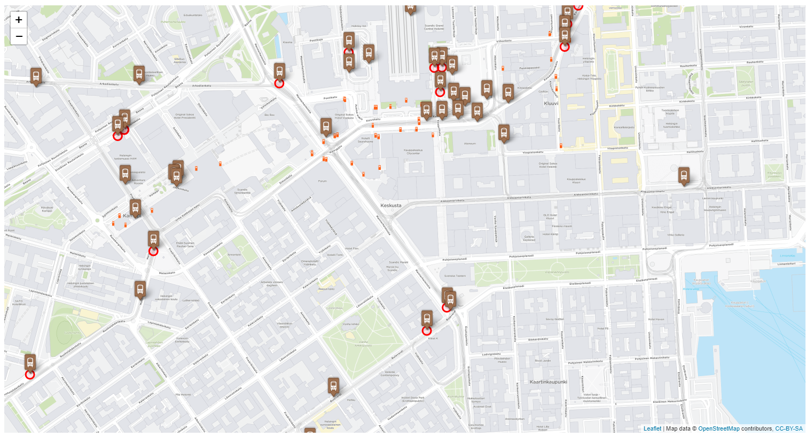
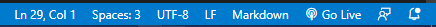
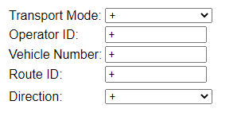
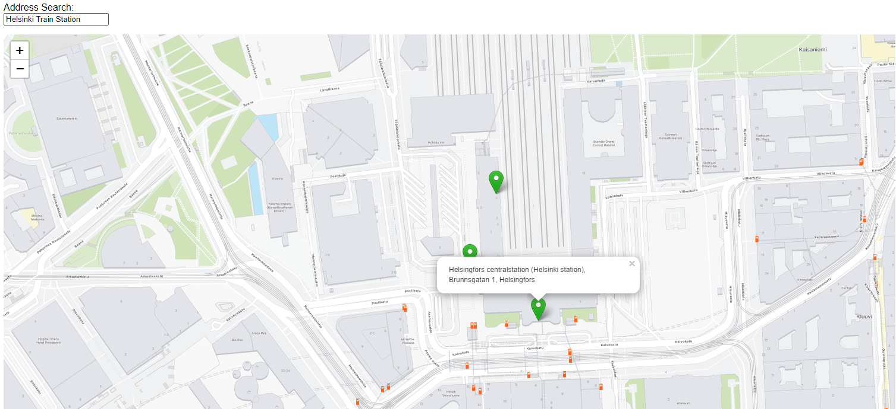
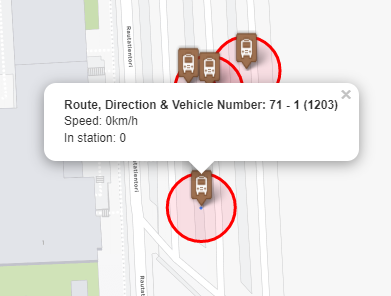
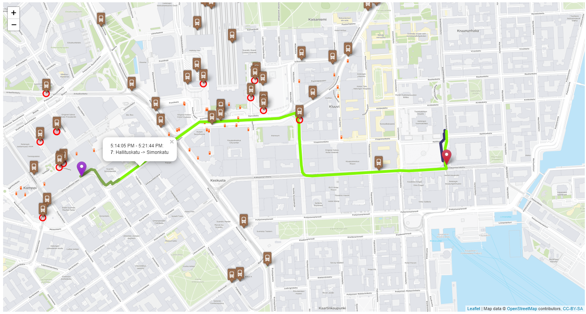

# IBD Project 2021-2022 - Real-Time Vehicle Monitoring for Helsinki

## Team Members:
Dimoiu Cezar-Gabriel  
Ioniță Alexandru   
Pribeagu Camelia  
Vlășceanu Ioana-Miruna  

## Introduction
This is the project for the Introduction to Big Data Course, build using the open-source code snippets and APIs provided by Digitransit for the Real-time public transportation monitoring app in Helsinki, Finland (https://digitransit.fi/en/developers/)  

Some screenshots of the running app:

## How to run:

### 1. Master branch: 

On the master branch, the project can be run using the Live Server extension for Visual Code. Please follow these steps:
1. Clone repo  
   <code>git clone https://github.com/alexionita99/IBD_project.git</code>

2. Install Live Server extension 
   <code> https://marketplace.visualstudio.com/items?itemName=ritwickdey.LiveServer </code>

3. On the bottom-right corner click on `Go Live`  

### 2. Beefy branch

On the Beefy branch, Browserify and Beefy are installed in the NodeJS server. To run it, follow these steps:

1. Clone repo  
   <code>git clone https://github.com/alexionita99/IBD_project.git</code>

2. Start the NodeJS server with the 
   <code> npm start </code> command

3. Open the app in a browser by accessing http://localhost:9966

## Filtering Fields

Because the purpose of the app is to monitor the public transport fleet in the region of Helsinki, some filtering fields were implemented:  
1. <b>Transport Mode </b> - select only one type of vehicles: bus, tram, train, ferry, metro or ubus
2. <b> Operator ID </b> - show only vehicles operated by a certain entity. The code should be 4 digits long, so add 0s before the actual code (e.g. 0012 for operator 12) 
The operators in the Helsinki region are:

| Operator ID      | Name |
| ----------- | ----------- |
| 12 | Helsingin Bussiliikenne Oy |
| 17 | Tammelundin Liikenne Oy |
| 18 | Oy Pohjolan Liikenne Ab |
| 20 | Bus Travel Åbergin Linja Oy |
| 21 | Bus Travel Oy Reissu Ruoti |
| 22 | Nobina Finland Oy |
| 30 | Savonlinja Oy |
| 36 | Nurmijärven Linja Oy |
| 40 | HKL-Raitioliikenne |
| 47 | Taksikuljetus Oy |
| 50 | HKL-Metroliikenne |
| 51 | Korsisaari Oy |
| 54 | V-S Bussipalvelut Oy |
| 58 | Koillisen Liikennepalvelut Oy |
| 59 | Tilausliikenne Nikkanen Oy |
| 60 | Suomenlinnan Liikenne Oy |
| 89 | Metropolia |
| 90 | VR Oy |
| 195 | Siuntio |

3. <b>Vehicle Number</b> - show only a certain vehicle on map. The code should be 5 digits long, with 0s (e.g. code 01215 for vehicle 1215)
4. <b>Route ID</b> - show only vehicles on one route. The code should be 4 digits longs, with a digit between 1-9 and eventually, 0s (e.g. 1001 for route 1, 2113 for route 113)
5. <b>Direction</b> - either 1 or 2, because each route has 2 directions

## Address Search Field

The <b>Address Search</b> field uses the Digitransit geocoding API to search for addresses. 

## Road Congestion

The red circles appear around vehicles when the speed is lower than 15 km/h and the doors are closed. This way, some basic information regarding the current road congestion can be gathered

## Routing API
Using the Digitransit routing API, routes from an origin point to a destination point can be generated, using real-time data from vehicles

